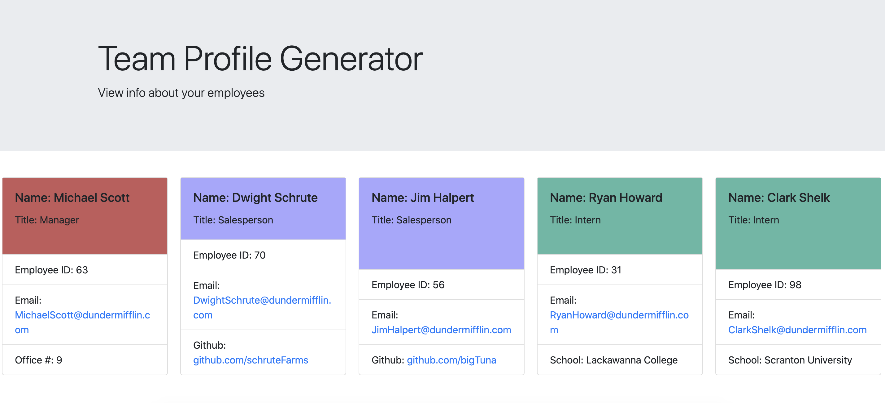

  # Project Name:

  Team Profile Generator

  ## License

   : [View License](https://opensource.org/licenses/MIT)

  ## Table of Contents

  - [Title](#Project-Name)
  - [License](#License)
  - [Description](#Description)
  - [Installation](#Installation)
  - [Usage](#Usage)
  - [Contributions](#Contributions)
  - [Tests](#Tests)
  - [Questions](#Questions)

  ## Description

  This is a node.js command line application that takes in information about employees on a software engineering team. It then generates HTML to display information about those employees. Finally, each of the class modules are tested using Jest

  ## Installation

  Navigate to the root directory of this repository and run the following commands to install necessary dependencies:

    npm i

  ## Usage

  

  ## Contributions 

  

  ## Tests 

  `npm run test`

  ## Questions 

  For issues, questions, and comments please contact epurpur@gmail.com or visit [https://github.com/epurpur](https://github.com/epurpur) 
  
  
  The result of running this application will be an HTML which looks something like this:
  
  
  
